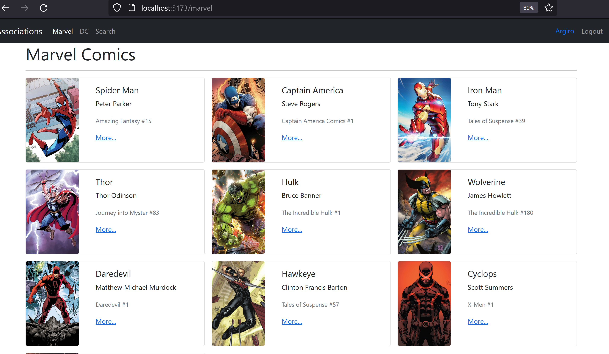
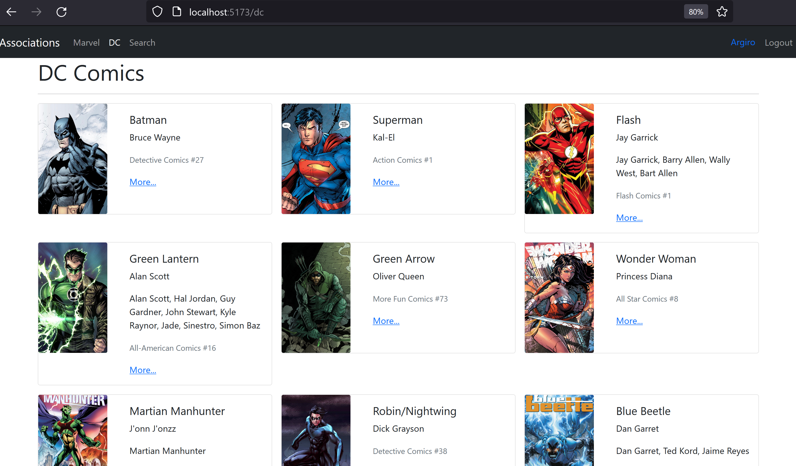
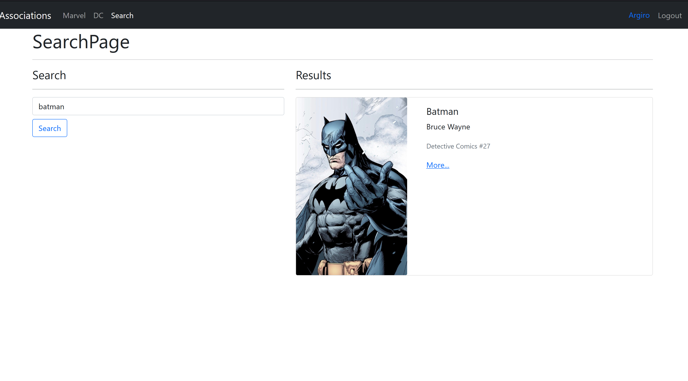
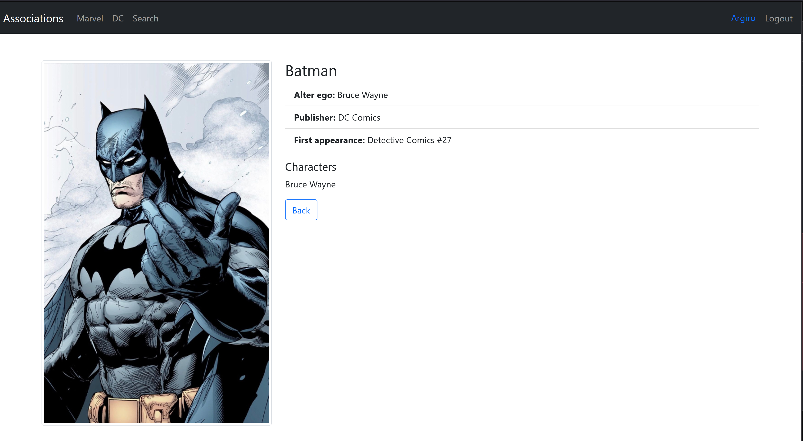

# Heroes SPA

## Descripción
Heroes SPA es una aplicación web de ejemplo que muestra una lista de héroes de cómics de DC Comics y Marvel Comics. Los usuarios pueden navegar y ver información detallada sobre cada héroe.

## Tecnologías Utilizadas
- React: Biblioteca de JavaScript para construir interfaces de usuario.
- React Router: Biblioteca para manejar la navegación entre diferentes vistas de la aplicación.
- Jest: Framework de pruebas unitarias.
- Vite: Herramienta de construcción y desarrollo rápido.
- ESLint: Herramienta para encontrar y corregir problemas en el código.
- query-string: Librería para manejar cadenas de consulta URL.

## Instalación
1. Clona este repositorio: `git clone https://github.com/elto82/heroes-spa.git`
2. Ingresa al directorio del proyecto: `cd heroes-spa`
3. Instala las dependencias: `npm install`

## Ejecutar la Aplicación
- Ejecuta en modo de desarrollo: `npm run dev`
- Construye la aplicación para producción: `npm run build`
- Ejecuta las pruebas: `npm test`

## Contribución
Si deseas contribuir a este proyecto, por favor sigue estos pasos:
1. Crea un fork del repositorio.
2. Clona tu fork: `git clone https://github.com/elto82/heroes-spa.git`
3. Crea una rama para tu contribución: `git checkout -b mi-contribucion`
4. Realiza los cambios y realiza commits: `git commit -m "Mi contribución"`
5. Sube los cambios a tu fork: `git push origin mi-contribucion`
6. Crea un Pull Request en GitHub.

## Licencia
Este proyecto está bajo la Licencia MIT. Ver [LICENSE](LICENSE) para más detalles.

